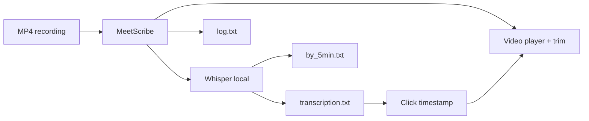

<div align="center">

# MeetScribe

**Turn meeting recordings into searchable text — with video sync, trim, and chapter navigation.**

Local desktop app powered by [OpenAI Whisper](https://github.com/openai/whisper).  
No cloud upload. Your video stays on your machine.

<br>


[Quick start](#quick-start) · [Features](#features) · [Usage](#usage) · [macOS setup](SETUP_MAC.md)

</div>

---

## Features

| | |
|---|---|
| **Transcription** | Whisper models `tiny` → `medium`, runs in background |
| **Video player** | Click `[00:12]` to seek · Shift+click to mark clip end |
| **Pop-out window** | **L** opens a resizable theater window · **⛶** fullscreen |
| **Playback speed** | `0.5x` – `2x` |
| **Resizable layout** | Drag the splitter between video and text |
| **Video trim** | Save a clip, remove start, or remove end (FFmpeg) |
| **Smart output** | Full transcript, 5-minute chapters, session log |



## Requirements

- **Python** 3.10+
- **[FFmpeg](https://ffmpeg.org/)** — transcription audio extract + video trim
- **[VLC](https://www.videolan.org/)** — recommended for audio and pop-out player
- **Disk** ~1–5 GB free (Whisper model size)

## Quick start

<details open>
<summary><strong>Windows — easiest</strong></summary>

**First time only** — double-click **`install.bat`** (creates `.venv`, installs packages, optional FFmpeg/VLC, Desktop shortcut).

**Every time** — double-click **`run.bat`** or the **MeetScribe** shortcut on your Desktop.

`run.bat` also finds an existing venv automatically (`MEETSCRIBE_VENV`, `.venv`, or `%USERPROFILE%\.venvs\meet-scribe`).

<details>
<summary>Manual setup (advanced)</summary>

```powershell
winget install Gyan.FFmpeg
winget install VideoLAN.VLC

git clone https://github.com/olithin/MeetScribe.git
cd MeetScribe

python -m venv .venv
.venv\Scripts\Activate.ps1
pip install --upgrade pip
pip install -r requirements.txt

run.bat
```

PowerShell blocks venv? Run once:

```powershell
Set-ExecutionPolicy -Scope CurrentUser RemoteSigned
```

</details>

</details>

<details>
<summary><strong>macOS</strong></summary>

Full guide: **[SETUP_MAC.md](SETUP_MAC.md)**

```bash
brew install python ffmpeg vlc
git clone https://github.com/olithin/MeetScribe.git
cd MeetScribe
python3 -m venv .venv
source .venv/bin/activate
pip install --upgrade pip
pip install -r requirements.txt
chmod +x run.sh
./run.sh
```

</details>

> First transcription downloads the Whisper model from the internet (~150 MB–1.5 GB).

## Usage

1. **Select MP4 file** — choose a meeting recording  
2. **Output folder** *(optional)* — default: next to the video  
3. Pick a **Whisper model** (default: `small`)  
4. **Start transcription** — progress bar + logs  
5. **Click timestamps** in the transcript to jump in the video  
6. **L** — pop-out player · drag splitter to resize · trim tools on the left  

### Output files

| File | Description |
|------|-------------|
| `{name}_transcription.txt` | Full text with `[MM:SS]` per phrase |
| `{name}_by_5min.txt` | 5-minute blocks — jump to any part of the call |
| `{name}_log.txt` | Session log + on-screen result |

**Example (`by_5min.txt`):**

```
========================================================================
[00:00 — 05:00]  — seek video to this mark
========================================================================

[00:00] Good morning, let's start the meeting.
[00:05] Today we'll review the sprint plan.

--- Block text ---
Good morning, let's start the meeting. Today we'll review the sprint plan.
```

### Whisper models

| Model | Speed | Quality | RAM |
|-------|-------|---------|-----|
| `tiny` | Fast | Basic | ~1 GB |
| `base` | Medium | Good | ~1 GB |
| `small` | Slower | Better | ~2 GB |
| `medium` | Slowest | High | ~5 GB |

## Project structure

```
MeetScribe/
├── main.py                  # GUI entry point
├── transcription_service.py # Whisper + FFmpeg + file output
├── video_player.py          # VLC player, speed, pop-out window
├── video_trim_service.py    # MP4 trim via FFmpeg
├── clickable_text.py        # Clickable timestamps in UI
├── run.bat / run.sh         # Launch scripts
├── requirements.txt
└── README.md
```

## Advanced: external venv

Set **`MEETSCRIBE_VENV`** so launch scripts find Python outside the project:

```powershell
# Windows (once)
[System.Environment]::SetEnvironmentVariable(
    "MEETSCRIBE_VENV", "C:\Users\You\.venvs\meet-scribe", "User")
```

```bash
# macOS (~/.zshrc)
export MEETSCRIBE_VENV="$HOME/.venvs/meet-scribe"
```

Lookup order: `MEETSCRIBE_VENV` → `TRANSCRIPTOR_VENV` → `.venv` → system Python.

## Troubleshooting

| Issue | Fix |
|-------|-----|
| FFmpeg not found | `winget install Gyan.FFmpeg` / `brew install ffmpeg` |
| VLC not found | `winget install VideoLAN.VLC` / `brew install vlc` |
| `No module named ...` | Activate venv → `pip install -r requirements.txt` |
| Out of memory | Use `tiny` or `base` |
| Empty transcript | Check audio in video; try another model |

## License

[MIT](LICENSE) — Whisper models/code by OpenAI, see [their license](https://github.com/openai/whisper/blob/main/LICENSE).

---

<div align="center">
<sub>Built for teams who review meeting recordings without sending video to the cloud.</sub>
</div>
